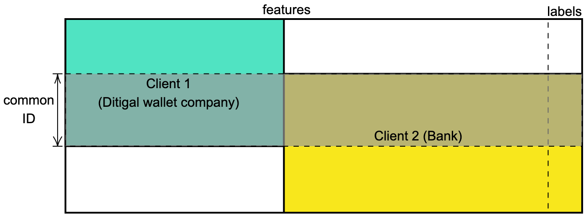

# `vFedCCE`
A vertical federated learning algorithm for classfication problems with gradient-based optimization.

## Data set structure

This algorithm is going to train a shared model on the common IDs (aligned by some private entity resolution technique) between vertically partitioned datasets, as shown in the following figure.

## The Proposed `vFedCCE` Algorithm

The algorithm itself can be described by the following sequence diagram.

[![](https://mermaid.ink/img/eyJjb2RlIjoic2VxdWVuY2VEaWFncmFtXG5Ob3RlIHJpZ2h0IG9mIENsaWVudCAxOiBHZW5lcmF0ZSBwdWJsaWMgYW5kIHByaXZhdGUga2V5c1xuQ2xpZW50IDEgLS0-PiBDbGllbnQgMjogU2VuZCBwdWJsaWMga2V5XG5sb29wIGluIGVhY2ggZXBvY2g6XG4gICAgbG9vcCBmb3IgZWFjaCBiYXRjaCBvZiBzaXplIE46XG4gICAgICAgIE5vdGUgcmlnaHQgb2YgQ2xpZW50IDE6IENhbGN1bGF0ZSBtb2RlbCBvdXRwdXQgYVxuICAgICAgICBOb3RlIHJpZ2h0IG9mIENsaWVudCAxOiBDYWxjdWxhdGUgcGFydGlhbCBncmFkaWVudHMgYSdfaWpcbiAgICAgICAgTm90ZSByaWdodCBvZiBDbGllbnQgMTogRW5jcnlwdCBhJ19paiB3aXRoIHB1YmxpYyBrZXk6IFtbYSdfaWpdXVxuICAgICAgICBDbGllbnQgMS0tPj5DbGllbnQgMjogU2VuZCBhIGFuZCBbW2EnX2lqXV1cbiAgICAgICAgTm90ZSBsZWZ0IG9mIENsaWVudCAyOiBDYWxjdWxhdGUgcHJlZGljdGlvbiBwID0gKGEgKyBiKS8yXG4gICAgICAgIE5vdGUgbGVmdCBvZiBDbGllbnQgMjogTG9zcyBvZiBwIGFnYWluc3QgbGFiZWxzIHlcbiAgICAgICAgTm90ZSBsZWZ0IG9mIENsaWVudCAyOiBDYWxjdWxhdGUgZ3JhZGllbnQgZzJcbiAgICAgICAgTm90ZSBsZWZ0IG9mIENsaWVudCAyOiBVcGRhdGUgaXRzIHdlaWdodHMgYmFzZWQgb24gZzJcbiAgICAgICAgTm90ZSBsZWZ0IG9mIENsaWVudCAyOiBBc3NlbWJsZSBbW2cxXV0gdmlhIFtbYSdfaWpdXVxuICAgICAgICBDbGllbnQgMi0tPj5DbGllbnQgMTogU2VuZCBjbGllbnQgMSdzIGdyYWRpZW50IFtbZzFdXSAoc3RpbGwgZW5jcnlwdGVkKVxuICAgICAgICBOb3RlIHJpZ2h0IG9mIENsaWVudCAxOiBEZWNyeXB0IFtbZzFdXSBmb3IgZ3JhZGllbnQgZzEgd2l0aCBwcml2YXRlIGtleVxuICAgICAgICBOb3RlIHJpZ2h0IG9mIENsaWVudCAxOiBVcGRhdGUgaXRzIHdlaWdodHMgYmFzZWQgb24gZzFcbiAgICBlbmRcbmVuZFxuICAgICAgICAgICAgIiwibWVybWFpZCI6eyJ0aGVtZSI6ImRlZmF1bHQifSwidXBkYXRlRWRpdG9yIjpmYWxzZSwiYXV0b1N5bmMiOnRydWUsInVwZGF0ZURpYWdyYW0iOmZhbHNlfQ)](https://mermaid-js.github.io/mermaid-live-editor/edit#)

Details of the algorithm can be found in the [report](./docs/report.pdf).

Details of the implementation (with TensorFlow and Keras) can be found under the directory [src](./src/).

<!-- ## Update

> This algorithm might be a duplicate of some previous research work that I was not aware of when proposing.

It just came into my attention that my result seems to be a special case of [[1\]](#_ftn1), with the following differences:

- `vFedCCE` encrypts the intermediate data under homomorphic encryption with the help of  [[2\]](#_ftn2).
- I directly studied the loss function of categorical cross entropy loss while [[1\]](#_ftn1) studied a general loss function.
- I studied the case of averaging local predictions as the final prediction, while [[1\]](#_ftn1) claimed that a similar process should work for any differentiable function to construct the final prediction.
- `vFedCCE` is applicable for any gradient-based optimization methods while [[1\]](#_ftn1) particularly studied asynchronous SGD.

---

[[1\]](#_ftnref1) Hu, Y., Niu, D., Yang, J., & Zhou, S. (2019, July). FDML: A  collaborative machine learning framework for distributed features. In *Proceedings of the 25th ACM SIGKDD International Conference on Knowledge Discovery & Data Mining* (pp. 2232-2240). -->

<!-- [[1\]](#_ftnref2) CSIRO's Data61.  (2013). Python Paillier Library. https://github.com/data61/python-paillier.  -->
